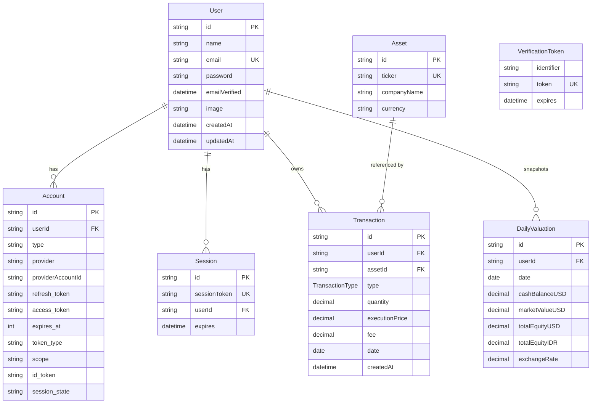

# Entity Relationship Diagram (ERD)

Skema basis data Prime Capital Ledger. Total **7 tabel** dengan **PostgreSQL** sebagai database utama. Empat tabel pertama (`User`, `Account`, `Session`, `VerificationToken`) mengikuti standar NextAuth untuk autentikasi. Tiga tabel berikutnya (`Asset`, `Transaction`, `DailyValuation`) merupakan domain inti aplikasi: master saham, ledger transaksi yang immutable, dan snapshot valuasi harian portofolio.

## Diagram

## Penjelasan Relasi

| Relasi | Kardinalitas | Keterangan |
|---|---|---|
| `User` → `Account` | 1 : N | Satu user dapat menautkan beberapa provider OAuth (Google, dst.). Cascade delete. |
| `User` → `Session` | 1 : N | Satu user dapat memiliki beberapa session aktif (multi-device). Cascade delete. |
| `User` → `Transaction` | 1 : N | Setiap user memiliki ledger transaksinya sendiri. |
| `User` → `DailyValuation` | 1 : N | Snapshot nilai portofolio harian per user, unique pada `(userId, date)`. |
| `Asset` → `Transaction` | 1 : N | Satu saham dapat muncul di banyak transaksi. `assetId` bersifat **opsional** untuk mendukung tipe `DEPOSIT` / `WITHDRAW` kas. |
| `VerificationToken` | standalone | Tabel tanpa relasi langsung (standar NextAuth untuk verifikasi email). |

## Catatan Desain

- **Presisi finansial:** semua kolom uang memakai `Decimal` (PostgreSQL `numeric`), bukan `Float`. Harga `Decimal(19, 4)`, kuantitas `Decimal(19, 9)` (mendukung pecahan saham), total IDR `Decimal(19, 2)`.
- **Immutable ledger:** tabel `Transaction` tidak memiliki kolom `updatedAt`. Sekali tercatat, baris transaksi tidak diubah - koreksi dilakukan dengan menambah transaksi baru (audit trail terjaga).
- **Indexing:** index ada pada `transactions(userId)`, `transactions(assetId)`, `transactions(userId, date)`, `daily_valuations(userId)`, `daily_valuations(date)`, plus unique constraint `(userId, date)` di `daily_valuations`.
- **Enum `TransactionType`:** `BUY`, `SELL`, `DEPOSIT`, `WITHDRAW`.

## Sumber

Skema definitif: `prisma/schema.prisma`.
