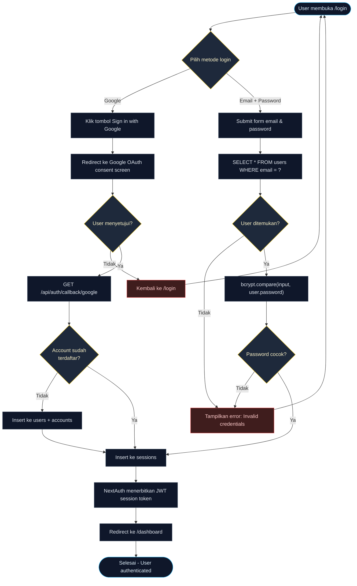
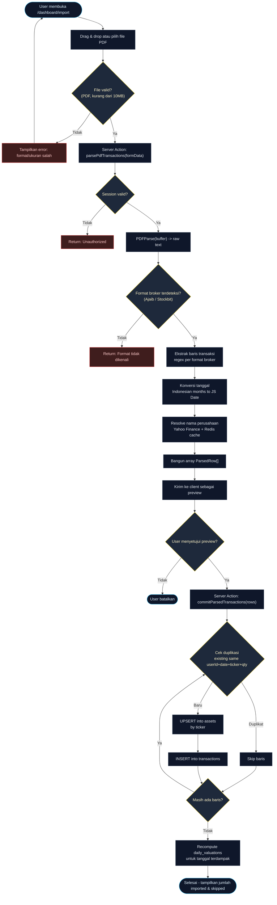

# Flowchart - Prime Capital Ledger

Dokumen ini berisi dua flowchart utama: **(A) Authentication Flow** dan **(B) PDF Import Flow**. Keduanya merepresentasikan jalur kode nyata yang ada di repository, bukan alur generik.

---

## A. Authentication Flow

Mencakup dua jalur login: **Google OAuth** dan **Email + Password (Credentials)**. Keduanya berakhir pada sesi JWT NextAuth dan redirect ke `/dashboard`.

### Catatan Implementasi

- Route handler NextAuth: `src/app/api/auth/[...nextauth]/route.ts`.
- Endpoint registrasi terpisah: `src/app/api/auth/register/route.ts` (membuat baris `users` baru dengan `bcrypt.hash`).
- Session disimpan di tabel **`sessions`** (managed by `@auth/prisma-adapter`).
- Strategi JWT: token disimpan di browser cookie; lookup `sessions` dipakai NextAuth untuk validasi/expiry.

---

## B. PDF Import Flow

Alur paling kompleks di aplikasi: user mengunggah laporan PDF dari Ajaib/Stockbit, parser mengekstrak transaksi, user mengonfirmasi, lalu data masuk ke ledger.

### Catatan Implementasi

- Server Action utama: `src/app/actions/import.ts` - fungsi `parsePdfTransactions()` dan `commitParsedTransactions()`.
- Library parsing: **`pdf-parse`** untuk mengekstrak text mentah, kemudian regex spesifik per broker (Ajaib vs Stockbit) untuk membaca baris transaksi.
- **Bulan dalam Bahasa Indonesia** (`Jan`, `Feb`, ..., `Des`) dipetakan ke index bulan JavaScript di awal file.
- **Yahoo Finance lookup** untuk mendapatkan nama perusahaan dilakukan sekali per ticker dan di-cache via Redis agar tidak memukul rate limit.
- **Deduplikasi** mencegah transaksi yang sama ter-import dua kali ketika user mengunggah laporan yang tumpang tindih periode.
- Setelah commit selesai, **`daily_valuations`** untuk tanggal-tanggal yang terdampak dibangun ulang agar dashboard menampilkan nilai yang benar.

---

## Ringkasan

| Flowchart | Tujuan | Tabel Tersentuh |
|---|---|---|
| **A. Authentication** | Mengamankan akses ke `/dashboard/*` | `users`, `accounts`, `sessions` |
| **B. PDF Import** | Menambahkan transaksi dalam batch dari laporan broker | `assets`, `transactions`, `daily_valuations` |

Kedua flow ini adalah jalur kode yang paling cocok untuk didemonstrasikan di sesi presentasi karena menyentuh paling banyak tabel sekaligus dan menampilkan integrasi sistem eksternal (Google OAuth + Yahoo Finance + PDF parsing + Redis cache).
