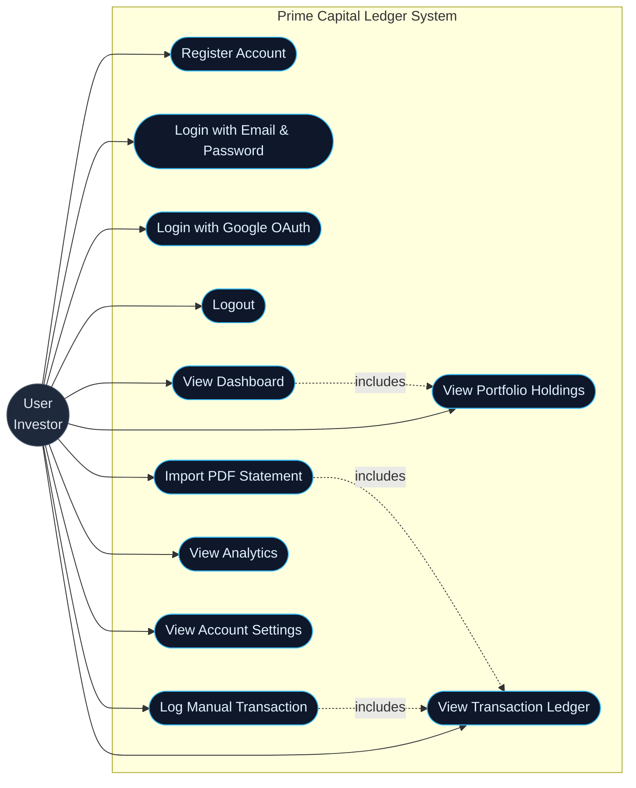
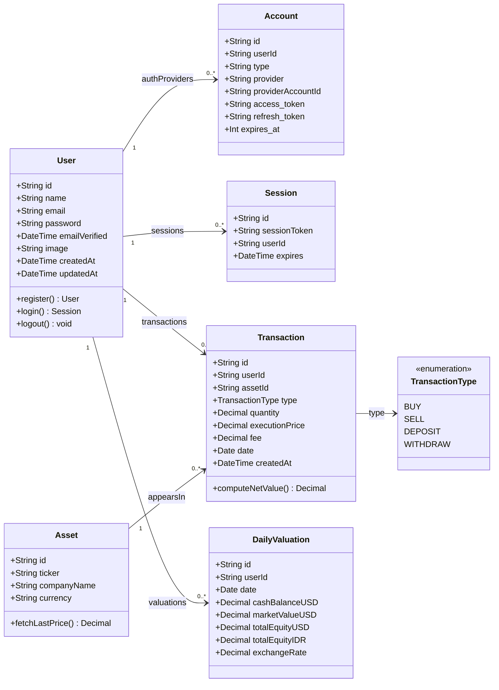

# UML — Prime Capital Ledger

Dokumen ini berisi dua diagram UML: **Use Case Diagram** (interaksi pengguna dengan sistem) dan **Class Diagram** (struktur entitas inti). Hanya fitur yang sudah diimplementasikan secara penuh yang ditampilkan.

---

## 1. Use Case Diagram

Aktor utama adalah **User (Investor)**. Sistem mencakup modul autentikasi, dashboard, portofolio, transaksi, import data, dan analitik.

### Daftar Use Case

| ID | Use Case | Deskripsi Singkat |
|---|---|---|
| UC1 | Register Account | Membuat akun baru via email + password (bcrypt) |
| UC2 | Login (Email/Password) | Autentikasi credentials lewat NextAuth |
| UC3 | Login (Google OAuth) | Autentikasi pihak ketiga, otomatis membuat baris `Account` |
| UC4 | Logout | Menghapus session dari `Session` table |
| UC5 | View Dashboard | Ringkasan total value, P&L, valuation chart, top traded |
| UC6 | View Portfolio Holdings | Tabel agregasi posisi berdasarkan transaksi |
| UC7 | View Transaction Ledger | Daftar lengkap transaksi BUY/SELL/DEPOSIT/WITHDRAW |
| UC8 | Log Manual Transaction | Form input transaksi dengan ticker search |
| UC9 | Import PDF Statement | Upload laporan Ajaib / Stockbit, preview, commit |
| UC10 | View Analytics | Return bulanan, alokasi sektor, metrik risiko |
| UC11 | View Account Settings | Profil, statistik transaksi, logout |

> Relasi `<<includes>>` menunjukkan use case yang memerlukan use case lain sebagai bagian dari alurnya. Contoh: setiap kali user `Import PDF Statement` (UC9), sistem secara implisit melakukan operasi yang sama dengan `View Transaction Ledger` (UC7) karena data masuk ke tabel yang sama.

---

## 2. Class Diagram

Diagram kelas berikut memetakan entitas inti aplikasi (sesuai `prisma/schema.prisma`). Setiap class memiliki atribut bertipe yang sesuai dengan kolom database.

### Catatan Class

- **`User`** adalah aggregate root untuk semua data milik pengguna; cascade delete diterapkan pada `Account` dan `Session`.
- **`Asset`** bersifat global (master data) — di-share antar user, tidak punya `userId`.
- **`Transaction`** adalah entitas *append-only* (tidak memiliki `updatedAt`). Koreksi dilakukan dengan menambah transaksi baru, bukan mengubah baris lama → audit trail terjaga.
- **`DailyValuation`** adalah snapshot yang dihasilkan oleh server (bukan input user) — dibangun ulang setiap kali transaksi baru di-commit.
- Enumerasi **`TransactionType`** disimpan di level PostgreSQL sebagai `ENUM`, bukan `string`, untuk integritas data.
